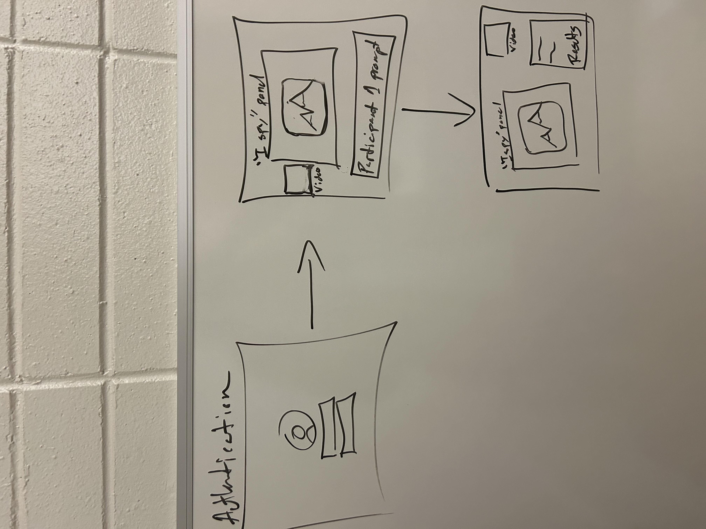
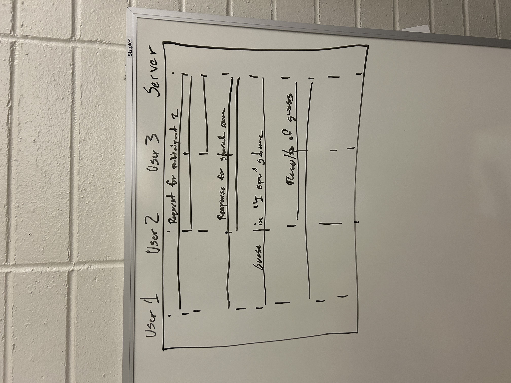

# Startup

## Specification Deliverable

### Elevator pitch

Language learning in a classroom simply isn't that effective. This service enables you to actually develop a second language by providing you with the most powerful resource at your disposal... real time collaborative learning with native speakers! Two language learners will be connected through video conferencing software and a shared activity workspace and there they will be able to give
 each other real-time feedback as they participate in SLA tasks.

### Design

### Key features

- Secure login over HTTPS
- Breaking up of active users into rooms of 2
- Ability to start video chat (using videosdk.live API)
- Display of prompt for participant 1 to select items to call out in the "I spy" game
- Shared display of the "I spy" game where participant 2 can mark their guesses
- Results are persistently stored 

### Technologies

- **HTML** - Uses correct HTML structure for application. Three HTML pages. One for being sorted into rooms, one for particpant 1 prompt, one for the "I spy" activity
- **CSS** - Application styling that looks good on different screen sizes, uses good whitespace, color choice and contrast
- **JavaScript** - Provides logic for login, videosdk API call, "I spy" game, backend endpoint calls 
- **Service** - Backend service with endpoints for:
  - login
  - room segregation
  - interaction within the "I spy" game
- **DB/Login** - Stores users, results in database. Register and login users. Credentials securely stored in database
- **WebSocket** - As each participant interact with the "I spy" game, all other players see the results 
- **React** - Application ported to use the React web framework

